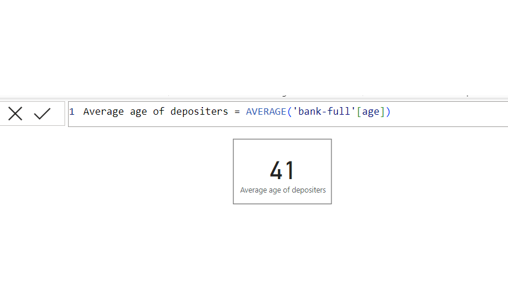
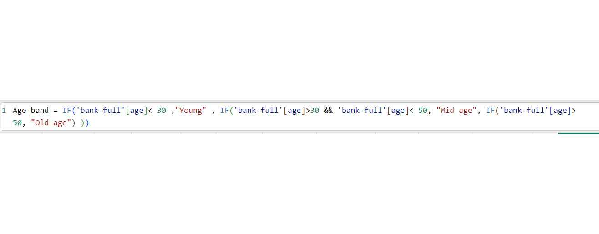
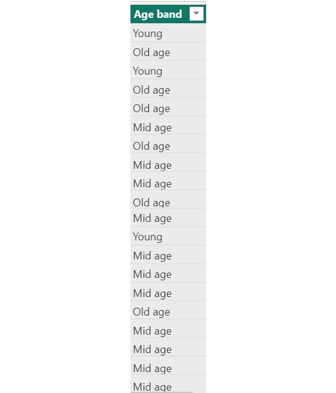

# Banking-Clients-dataset-Analysis-Using-Dax
## Problem Statement
1.	Create a measure for the ‘Average age of depositors’

2.	Create a new column named ‘Age band’ containing the following:
   
•	‘Young’ for ages below 30

•	‘Mid-aged’ for ages between 30 and 50

•	‘Old’ for ages above 50

4.	Create a measure calculating the total balance for:

a.	Job: Technician

b.	Marital: Single and Married

5.	Create a measure to get the number of depositors on Loan
## Analysis and Dax
## Create a measure for the ‘Average age of depositors’

## Create a new column named ‘Age band’ containing the following:
   
•	‘Young’ for ages below 30

•	‘Mid-aged’ for ages between 30 and 50

•	‘Old’ for ages above 50
Formula                             |          Table
:----------------------------------:|:----------------:
           |     

