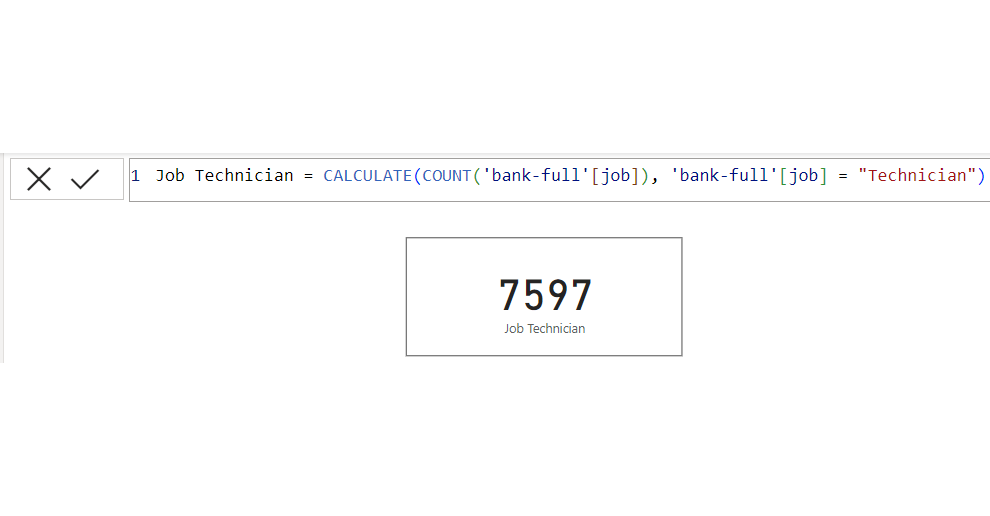
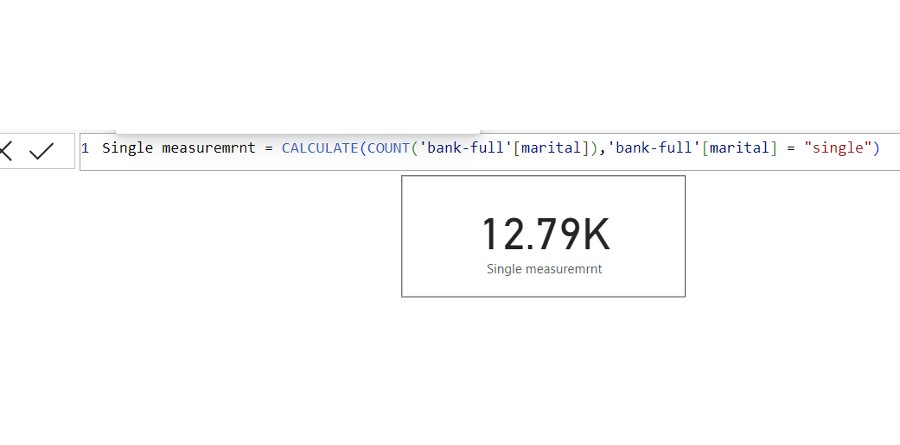
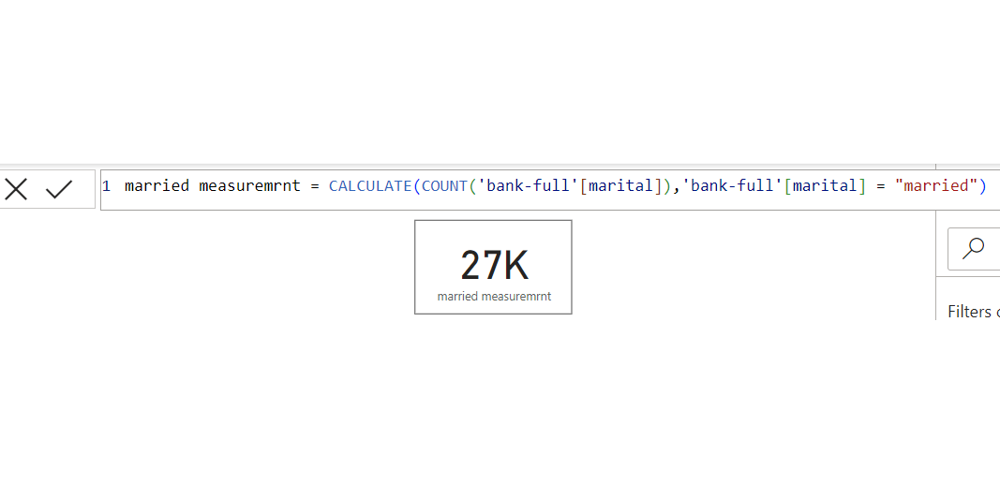
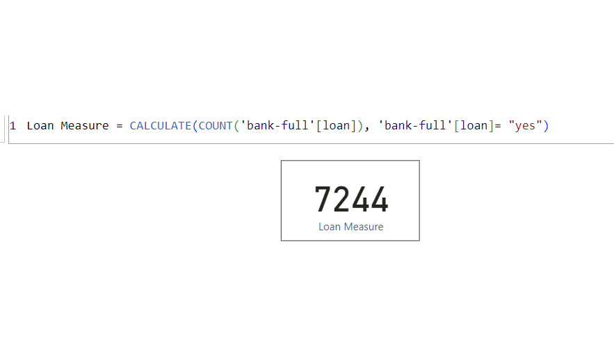

# Banking-Clients-dataset-Analysis-Using-Dax
## Introdution
This task is to demonstrate analysis of the Northwind traders dataset using Microsoft Power BI (DAX) for practicing purposes, the analysis requirements are to develop DAX measure for the problem statement questions  
## Problem Statement
1.	Create a measure for the ‘Average age of depositors’

2.	Create a new column named ‘Age band’ containing the following:
   
 •	‘Young’ for ages below 30

 •	‘Mid-aged’ for ages between 30 and 50

 •	‘Old’ for ages above 50

4.	Create a measure calculating the total balance for:

a.	Job: Technician

b.	Marital: Single and Married

5.	Create a measure to get the number of depositors on Loan
## Analysis and Dax
## Create a measure for the ‘Average age of depositors’

## Create a new column named ‘Age band’ containing the following:
   
## •	‘Young’ for ages below 30

## •	‘Mid-aged’ for ages between 30 and 50

## •	‘Old’ for ages above 50
Formula                             |          Table
:----------------------------------:|:----------------:
           |     

## Create a measure calculating the total balance for:
## Job: Technician

## Marital: Single and Married
Single                              |          Married
:----------------------------------:|:----------------:
                     |     

## Create a measure to get the number of depositors on the Loan

